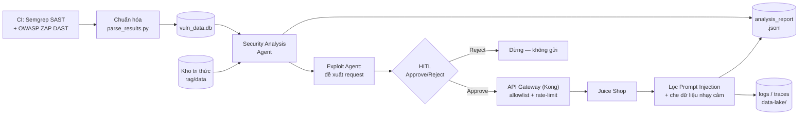

# Project Sentinel

Hạ tầng DevSecOps + AI-assisted pentest thực hành trên **OWASP Juice Shop** (staging giả lập bằng Docker Compose).

## Phiên bản target


| Mục             | Giá trị                                        |
| --------------- | ---------------------------------------------- |
| Juice Shop      | **v20.1.1**                                    |
| Commit          | `f915bddd82790d0f3018902d36ae9b4241a5f51f`     |
| Pin file        | `juice-shop/.sentinel-pin`                     |
| App (ZAP/debug) | [http://localhost:3000](http://localhost:3000) |
| Kong (agents)   | [http://localhost:8000](http://localhost:8000) |


## Cấu trúc thư mục

5 phút để nhớ lại repo này tổ chức thế nào — nhóm theo **vai trò**, không theo tuần:

```
Project-Sentinel/
├── AGENTS.md                # Quy tắc cho AI coding agent (đọc trước khi sửa code)
├── CLAUDE.md                # Ghi chú riêng cho Claude Code, trỏ về AGENTS.md
├── README.md                # File này
│
├── agents/                  # SOURCE — AI agent (Recon/Fuzz/Exploit/Analysis/Supervisor) + LLM client
├── rag/                     #   ├─ rag/data/  = corpus tri thức (input, có version)
├── api/                     #   └─ Live demo web (FastAPI) — deploy Vercel
├── kong/, guardrails/       #   API gateway + guardrail config cho agent
├── scripts/                 # Script vận hành/demo một lần (không phải test)
├── tests/                   # TESTS — chạy: python tests/<file>.py
│
├── data-lake/                # DATASET/OUTPUT máy đọc — SQLite, JSONL, trace, artefact CI
├── juice-shop/               # Target bị quét (vendor, pin v20.1.1) — không phải code của mình
│
├── docs/                     # Tài liệu sản phẩm SỐNG (PRD, Runbook, FinOps, Business Case)
│   └── notes/                 #   Ghi chú kỹ thuật theo chủ đề (không phải báo cáo tuần)
└── reports/                  # Báo cáo tiến độ theo TUẦN — đã nộp thì KHÔNG sửa nữa
    ├── week-1/, week-2/, week-3/, ...report.md (≤1 trang, quá trình + kết quả)
    └── PROGRESS.md             # Nhật ký tiến độ toàn dự án (được phép cập nhật liên tục)
```

## Kiến trúc — luồng đầu-cuối




Chi tiết: mọi bước ghi log vào `data-lake/` (traces, request_log, hitl_decisions) — xem
`scripts/e2e_report.py` để chạy cả luồng và lấy metrics (thời gian xử lý, số request, số cảnh báo, số
Approve/Reject, lỗi LLM/app).

Quy tắc report vs code: **code** trong `agents/`, `api/`, `rag/`... là của chung project, thay đổi
liên tục theo thời gian. **Báo cáo** trong `reports/week-N/` là hồ sơ lịch sử tại thời điểm nộp —
không chỉnh sửa lại để khớp code mới. Chi tiết: `[reports/README.md](reports/README.md)`.

## Chạy staging

```bash
# Khuyến nghị: dùng image pin (không build — tránh npm ECONNRESET)
docker compose up -d
# http://localhost:3000  — Juice Shop
# http://localhost:8000  — Kong gateway
docker compose ps
docker compose down
```

Build từ source (chỉ khi sửa file trong `juice-shop/`, vd. thêm fixture demo cho guardrails):

```bash
docker compose -f docker-compose.yml -f docker-compose.from-source.yml up -d --build
```

## LLM provider — DeepSeek V4 Flash 0731 (qua OpenRouter)

Provider **duy nhất**: DeepSeek V4 Flash qua OpenRouter (OpenAI-compatible). Không dùng OpenAI/Gemini/Anthropic.

```bash
cp .env.example .env          # rồi dán OpenRouter API key (sk-or-v1-...) vào OPENAI_API_KEY
# OPENAI_BASE_URL=https://openrouter.ai/api/v1 · OPENAI_MODEL=deepseek/deepseek-v4-flash-0731
```

Tạo key: [https://openrouter.ai/keys](https://openrouter.ai/keys) · Để trống key → agents chạy **MOCK offline** (không gọi mạng).

## Python setup & demo offline (MOCK LLM)

```bash
pip install -r requirements.txt
python scripts/seed_sample_reports.py
python rag/ingest.py && python rag/evaluate_retrieval.py
python agents/run_syndicate.py          # auto HITL + injection probes
python agents/eval_pipeline.py --both
python tests/test_kong_iam.py         # cần compose up
python scripts/finops_report.py
```

API keys Kong demo: `recon-key-demo` (GET), `exploit-key-demo` (POST).

## Tuần 3 — Security Analysis Agent

Đọc findings đã chuẩn hóa → gộp trùng → phân loại severity → giải thích + đề xuất fix → **JSONL**.
Mỗi finding truy vết `evidence.source_ids` về row DB (evidence-based, không bịa).

Báo cáo: `reports/week-3/2026-08-07_NguyenThanhAnhQuan_Week3.md` · Chi tiết kỹ thuật: `reports/week-3/details.md` · Plan: `reports/week-3/plan.md`
System Prompt: `agents/prompts/analysis_system_prompt.txt`

```bash
python scripts/seed_sample_reports.py     # ~140 rows (111 Semgrep + 29 ZAP) → vuln_data.db
python rag/ingest.py                      # kho tri thức tuần 2 (nếu chưa ingest)
python agents/analysis_agent.py --md      # → data-lake/analysis_report.jsonl (+ .md)
python tests/test_analysis_agent.py     # 3 tình huống: happy / empty / injection

# Live demo UI (MOCK, không cần API key)
python scripts/demo_analysis_agent.py     # seed → analyze → http://127.0.0.1:8790
# hoặc: python scripts/demo_analysis_server.py
```

## Live demo — Vercel (FastAPI)

Dashboard demo Tuần 1-5 chạy bằng FastAPI (`api/index.py`), thay cho Streamlit cũ — Streamlit
cần một server sống liên tục nên không deploy được lên Vercel serverless. Route: `/` (tổng quan),
`/scan` (Tuần 1), `/knowledge` (Tuần 2), `/agent` (Tuần 3), `/gateway` (Tuần 4), `/guardrails`
(Tuần 5).

```bash
pip install -r requirements.txt
uvicorn api.index:app --reload    # http://127.0.0.1:8000
```

Deploy lên Vercel: import repo GitHub này vào Vercel (Zero Config — Vercel tự nhận diện FastAPI là
"backend framework" và route đúng path gốc; `vercel.json` chỉ khai báo `maxDuration`, **không** khai
`rewrites` — thêm rewrite `/(.*) → /api/index` sẽ làm mọi route trả 404, xem `AGENTS.md`). Đặt biến
môi trường `OPENAI_API_KEY` / `OPENAI_BASE_URL` / `OPENAI_MODEL` trong Project Settings → Environment
Variables nếu muốn chạy LLM thật (bỏ trống → MOCK offline; xem `.env` local để lấy giá trị thật).

Do Vercel serverless không có filesystem ghi bền vững, nút "Chạy Agent ngay" chạy Agent thật trên dữ
liệu hiện có nhưng không ghi đè `analysis_report.jsonl` trong repo — kết quả chỉ hiển thị cho lần bấm
đó. Toàn bộ dữ liệu hiển thị khác (`vuln_data.db`, `rag/store/*`, báo cáo đã commit) đọc thẳng từ
snapshot có sẵn trong repo.

`/gateway` (Tuần 4) và `/guardrails` (Tuần 5) cũng chạy thật trên Vercel — không phải Kong container
(Vercel serverless không dựng Docker được) nhưng logic ACL/path-deny chạy lại đúng luật thật trong
`kong/kong.yml`, đề xuất của Exploit Agent gọi AI thật/mock theo đúng `OPENAI_API_KEY` đã cấu hình,
và 2 cơ chế guardrail/PII-redaction của Tuần 5 luôn là code thật (regex thuần, không mock). Muốn xem
Kong container thật: `docker compose up -d` cục bộ (xem mục Tuần 4 dưới).

## Tuần 4 — API Gateway và kiểm thử request an toàn

Live demo: `/gateway` trên Vercel (policy simulator chạy đúng luật `kong.yml` + đề xuất AI thật của
Exploit Agent + bằng chứng đã ghi nhận). Chạy đầy đủ với Kong container thật (cần Docker cục bộ):

Báo cáo: `reports/week-4/2026-08-15_NguyenThanhAnhQuan_Week4.md` · Nền tảng Gateway/IAM: `reports/week-2/2026-07-31_NguyenThanhAnhQuan_Week2.md`

```bash
docker compose up -d
python tests/test_kong_iam.py              # 401 / 403 method / 403 path
python tests/test_kong_rate_limit.py       # 429 trên write
python tests/test_kong_rate_limit_read.py  # 429 trên read
# terminal riêng:
python agents/mcp_server.py
python scripts/demo_mcp_a2a.py
python agents/kong_http_tool.py --agent recon-agent --path "/rest/products/search?q=apple"
python agents/exploit_agent.py --yes         # Agent đề xuất request → tool thực thi qua gateway
```

Allowlist client: `kong/allowlist.json`. Path `/rest/admin` bị deny mọi agent.

## Tuần 5 — Guardrails, phê duyệt thủ công, che dữ liệu nhạy cảm

Chống prompt injection (nội dung ứng dụng = dữ liệu không tin cậy), Human-in-the-Loop (Approve/Reject
có hiển thị Endpoint/Payload/Purpose trước request nguy hiểm), và che Email/Phone/Token/API key/Password
trước khi vào LLM hoặc log.

Báo cáo: `reports/week-5/2026-08-19_NguyenThanhAnhQuan_Week5.md`

```bash
python tests/test_guardrails_week5.py       # 9 case: injection / sensitive-data / approval → 23/23 PASS
python agents/recon_agent.py                # injection_before.json vs injection_after.json (guardrail)
python agents/exploit_agent.py --yes          # demo HITL Approve → gửi request
python agents/exploit_agent.py --reject-demo  # demo HITL Reject → chặn request
python agents/pii_redaction.py --demo         # demo che email/phone/ssn/token/apikey/password
```

**Cũng có trên live demo Vercel**: `/guardrails` gọi trực tiếp `agents/guardrails.py::check_input()`
và `agents/pii_redaction.py::redact()` thật trên input tự nhập (không mock), cùng demo HITL
Approve/Reject và nút chạy lại `tests/test_guardrails_week5.py` thật. Các lệnh CLI trên vẫn hữu ích
để xem log/trace chi tiết hơn hoặc chạy offline.

## Tuần 6 — Tích hợp, đánh giá và thuyết trình

Luồng đầu-cuối thật trên Docker Compose (Kong thật, không phải gateway thay thế): quét → chuẩn hóa →
Security Analysis Agent → đề xuất request → Approve/Reject → Kong → lọc injection/PII → báo cáo. Sơ đồ:
xem mục "Kiến trúc" phía trên.

Báo cáo: `reports/week-6/2026-08-19_NguyenThanhAnhQuan_Week6.md` · Kết quả: `docs/RESULTS_REPORT.md` ·
Eval Security Analysis Agent (8 case): `docs/notes/EVAL_SECURITY_AGENT.md` · Bản mô tả sản phẩm:
`docs/PRODUCT_BRIEF.md` · Demo 10-15 phút: `docs/DEMO_CHECKLIST.md`

```bash
docker compose up -d
python scripts/e2e_report.py       # luồng đầu-cuối + metrics: thời gian, request, cảnh báo, approve/reject, lỗi
```

## Tiến độ

Bám theo đúng 6 tuần của đề (`[NCUD-GPAI] VinUni x VinSOC 6-week of Project Sentinnel.pdf`):


| Tuần | Nội dung (theo đề)                                   | Trạng thái                            | Báo cáo                                                                                   |
| ---- | ---------------------------------------------------- | ------------------------------------- | ----------------------------------------------------------------------------------------- |
| 1    | Chuẩn bị môi trường + quét bảo mật cơ bản            | ✅ Done                                | `[week-1/README.md](reports/week-1/README.md)`                                            |
| 2    | Chuẩn hóa kết quả quét + xây kho tri thức            | ✅ Done                                | `[gap-analysis-week1-3.md](reports/gap-analysis-week1-3.md)` § Tuần 2                     |
| 3    | Xây dựng Security Analysis Agent                     | ✅ Done — 13/13 test, live demo Vercel | `[week-3/2026-08-07_..._Week3.md](reports/week-3/2026-08-07_NguyenThanhAnhQuan_Week3.md)` |
| 4    | API Gateway + kiểm thử request an toàn               | ✅ Done — 13/13 tiêu chí PASS, live demo Vercel | `[week-4/2026-08-15_..._Week4.md](reports/week-4/2026-08-15_NguyenThanhAnhQuan_Week4.md)` |
| 5    | Guardrails, phê duyệt thủ công, che dữ liệu nhạy cảm | ✅ Done — 23/23 test PASS, live demo Vercel | `[week-5/2026-08-19_..._Week5.md](reports/week-5/2026-08-19_NguyenThanhAnhQuan_Week5.md)` |
| 6    | Tích hợp, đánh giá và thuyết trình                   | ⏳ Chưa làm                            | —                                                                                         |


Chi tiết nhật ký: `reports/PROGRESS.md`. Demo: `docs/DEMO_CHECKLIST.md`. Runbook: `docs/RUNBOOK.md`.

## An toàn

Mọi fuzz/exploit **chỉ** nhắm `localhost` / dịch vụ Compose. Không tấn công host ngoài.