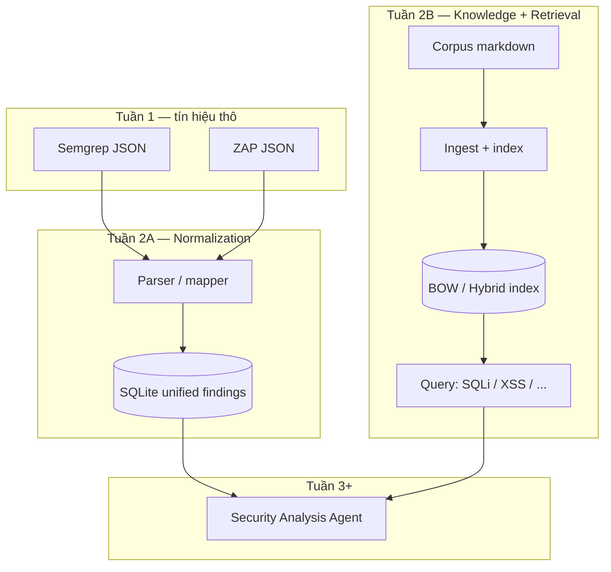
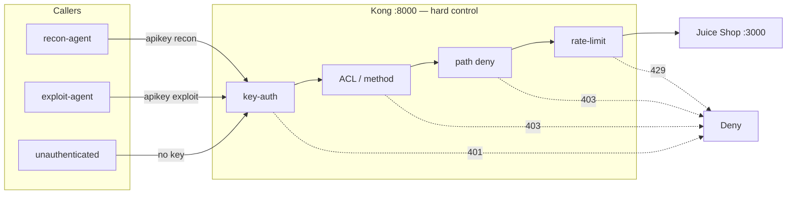

# Week 2 Report

**Project:** Sentinel · **Target:** OWASP Juice Shop (Docker Compose, localhost)  
**Đề:** VinUni × VinSOC — lộ trình **6 tuần** · **Tuần 2:** chuẩn hóa kết quả quét + kho tri thức + tìm kiếm  
**Song song:** nền **Tuần 4** — API Gateway + Agent IAM (Kong)

---

## 1. Cơ chế hoạt động (theo cách mình hiểu)

### 1.1 Vấn đề kỹ thuật tuần 2 giải quyết

Tuần 1 đã có tín hiệu bảo mật từ hai hướng bổ sung nhau:

| Nguồn     | Loại | Giá trị                                  | Hạn chế nếu để raw                        |
| --------- | ---- | ---------------------------------------- | ----------------------------------------- |
| Semgrep   | SAST | Lỗ hổng trong mã nguồn, path/file cụ thể | Schema JSON riêng; nhiễu `WARNING`/`INFO` |
| OWASP ZAP | DAST | Lỗ hổng trên app đang chạy, URL/instance | Schema khác SAST; risk label khác thang   |

Nếu để nguyên hai “giọng” JSON, lớp AI/agent tuần 3+ sẽ phải viết parser riêng từng tool, dễ lệch field, khó gộp trùng, khó truy vết.  
**Tuần 2 = lớp trung gian (normalization + knowledge)** giữa tool scan và agent.

### 1.2 Thiết kế 3 lớp (deliverable tuần 2)

**Lớp A — Chuẩn hóa finding (data contract)**  
Em viết pipeline đọc JSON Semgrep/ZAP và map về một schema dùng chung trong SQLite:

| Field         | Ý nghĩa thiết kế                           |
| ------------- | ------------------------------------------ |
| `tool`        | Nguồn phát hiện (truy vết SAST vs DAST)    |
| `severity`    | Mức nghiêm trọng theo nhãn gốc của tool    |
| `name`        | Tên/check id / alert name                  |
| `description` | Mô tả ngắn để agent/RAG dùng               |
| `path_or_url` | File (SAST) hoặc URI (DAST) — “chỗ xảy ra” |
| `timestamp`   | Thời điểm ingest                           |

**Quyết định có chủ đích:** chưa ép `severity` về một thang chung (`critical/high/medium…`) trong tuần 2. Lý do: giữ fidelity với tool gốc để mentor/audit đối chiếu raw report; việc map thang chung có thể làm ở agent (tuần 3) khi đã có policy ưu tiên. Đây là trade-off **truy vết được** vs **đẹp ngay**.

**Lớp B — Kho tri thức nhỏ (grounding)**  
Agent không nên “bịa” định nghĩa lỗ hổng. Em dựng corpus ~20 tài liệu có chủ đề rõ:

- Chuẩn / taxonomy: OWASP Top 10
- Phòng thủ: cheat sheet SQLi / XSS / auth
- Bối cảnh CVE: Log4Shell, Struts, SQLi→RCE
- Tool literacy: Semgrep, ZAP
- Gắn lab: pentest notes Juice Shop (search SQLi, XSS, access)
- Ví dụ lỗ hổng thường gặp: IDOR, SSRF, CSRF, path traversal…

**Lớp C — Retrieval có đo (không chỉ “có search”)**  
Ingest → index local (BOW/TF-IDF + cosine; hybrid với BM25-style).  
Quan trọng hơn “chạy được” là **đo được**: bộ 10 câu hỏi cố định, báo cáo accuracy / P@3 / MRR.  
Như vậy tuần 2 chứng minh được tiêu chí đề: hỏi “SQL Injection” / “XSS” → trả về tài liệu đúng hướng, và có số liệu chứ không chỉ demo tay.

### 1.3 Song song tuần 4 — vì sao làm sớm Gateway + IAM

Tuần 4 (đề 6 tuần) yêu cầu agent gửi request thử **qua API Gateway**, có API key, allowlist, giới hạn tốc độ, log không lộ secret.  
Em chủ động dựng nền sớm vì:

1. **Blast radius:** agent + full quyền gọi thẳng app = một lần hijack/prompt injection là đụng cả staging.
2. **Separation of concerns:** quyền (policy) không đặt trong system prompt — prompt là soft control; Kong là hard control.
3. **Fail-closed:** không key → 401; sai method/path → 403; spam → 429. Proof bằng **deny**, không chỉ bằng 200 OK.
4. **Identity ≠ capability:** API key chỉ trả lời “ai đang gọi”; ACL + path deny + allowlist trả lời “được làm gì”.

Ma trận least privilege đang dùng:

| Identity  | Capability đọc (GET) | Capability ghi (POST) | Path nhạy cảm `/rest/admin` |
| --------- | -------------------- | --------------------- | --------------------------- |
| (none)    | ❌ 401                | ❌ 401                 | ❌ 401                       |
| `recon`   | ✅                    | ❌ 403                 | ❌ 403                       |
| `exploit` | ✅                    | ✅ + rate-limit        | ❌ 403                       |

Defense-in-depth: Kong là hàng rào chính; client allowlist (method/path/host localhost-only, timeout, cắt body, redact API key trong log) là lớp phụ — tuần 4 sẽ khoe sâu hơn trên nền này.

---

## 2. Flow hoạt động

### 2.1 Luồng chính — Tuần 2

### 2.2 Kiến trúc song song — nền Tuần 4 (Gateway + IAM)

---

## 3. Kết quả

### 3.1 Normalization — output đo được

| Nguồn            | Bản ghi sau map | Tỷ trọng | Ý nghĩa                         |
| ---------------- | --------------- | -------- | ------------------------------- |
| Semgrep (SAST)   | 111             | 79%      | Bao phủ mã nguồn / pattern tĩnh |
| OWASP ZAP (DAST) | 29              | 21%      | Bao phủ hành vi runtime / URL   |
| **Tổng unified** | **140**         | 100%     | Một DB cho agent tiêu thụ       |

Phân bố severity (nhãn gốc — chưa unify):

| Nhóm quan sát     | Ví dụ nhãn                                | Ghi chú kỹ thuật                |
| ----------------- | ----------------------------------------- | ------------------------------- |
| SAST cao tín hiệu | `ERROR` (39)                              | Ưu tiên review trước ở tuần 3   |
| SAST nhiễu hơn    | `WARNING` (59), `INFO` (9)                | Cần triage / dedup sau          |
| DAST riskdesc     | `High` / `Medium` / `Low` / Informational | Thang chữ của ZAP, khác Semgrep |

→ Con số **140** không phải “càng nhiều càng tốt”; tuần 2 chỉ chứng minh **hợp nhất được**. Việc giảm FP thuộc triage/agent (tuần 3) hoặc filter policy.

### 3.2 Knowledge base — cấu trúc corpus (20 tài liệu)

| Nhóm                     | Số lượng (khoảng) | Mục đích khi retrieve    |
| ------------------------ | ----------------- | ------------------------ |
| OWASP / cheat sheets     | 4                 | Định nghĩa + cách phòng  |
| CVE mẫu                  | 3                 | Ngữ cảnh exploit thực tế |
| Tool notes (Semgrep/ZAP) | 2                 | Hiểu output scan         |
| Pentest Juice Shop       | 3                 | Neo vào lab cụ thể       |
| Ví dụ vuln class         | 8                 | Bao phủ lớp lỗ phổ biến  |

### 3.3 Retrieval quality — số liệu eval (10 câu cố định)

| Mode                | Accuracy         | P@3  | MRR      | Đọc số liệu thế nào                  |
| ------------------- | ---------------- | ---- | -------- | ------------------------------------ |
| BOW / vector-or-bow | **10/10 (1.00)** | 0.60 | **1.00** | Luôn có doc đúng; thường hạng 1      |
| Hybrid              | **10/10 (1.00)** | 0.60 | **1.00** | Tương đương trên bộ test hiện tại    |
| Hybrid + GraphRAG*  | 10/10 (1.00)     | 0.57 | 0.95     | Có sẵn; **không bắt buộc** đề 6 tuần |

GraphRAG là phần mở rộng — nêu để minh bạch scope, không nhận là deliverable tuần 2.

**Đối chiếu tiêu chí đề tuần 2**

| Tiêu chí PDF                              | Evidence                                         |
| ----------------------------------------- | ------------------------------------------------ |
| Chương trình chuẩn hóa                    | Parser → 140 rows schema chung                   |
| Tệp/DB tổng hợp cảnh báo                  | SQLite unified findings                          |
| Kho tri thức nhỏ                          | 20 docs đủ nhóm trên                             |
| Search trả về tài liệu liên quan SQLi/XSS | Eval chứa câu SQLi/XSS; accuracy 10/10, MRR 1.00 |

### 3.4 Song song tuần 4 — Gateway + IAM (verified 2026-07-28)

| Test case                        | Expected           | Actual         | Ý nghĩa kỹ năng                               |
| -------------------------------- | ------------------ | -------------- | --------------------------------------------- |
| GET không key                    | 401                | PASS           | Authentication bắt buộc                       |
| Recon GET products               | 2xx                | PASS           | Least privilege vẫn đủ làm recon              |
| Recon POST `/api/Users`          | 403                | PASS           | Tách capability ghi khỏi identity recon       |
| Exploit POST qua Kong            | không 401/403 Kong | PASS (app 400) | Gateway cho phép; lỗi nghiệp vụ app ≠ lỗi IAM |
| GET `/rest/admin` (cả hai agent) | 403                | PASS           | Path deny độc lập method allow                |
| Client deny recon POST           | deny               | PASS           | Defense-in-depth phía tool                    |
| **Tổng**                         | —                  | **7/7 PASS**   | Deny-table xanh                               |
| Rate-limit write                 | 429                | Quan sát được  | Chống spam / runaway agent                    |

---

## 4. Bằng chứng / Verification

> Mục này thay “Precision (Pro judge)” của tuần 1: tuần 2 không chấm TP/FP finding, mà **verify data contract + retrieval + (song song) control plane**.

### 4.1 Rubric tự chấm — deliverable tuần 2

| #   | Hạng mục                 | Tiêu chí pass                        | Kết quả               | Confidence |
| --- | ------------------------ | ------------------------------------ | --------------------- | ---------- |
| 1   | Multi-tool ingest        | ≥2 nguồn → 1 schema                  | ✅ Semgrep + ZAP → 140 | Cao        |
| 2   | Schema đủ dùng cho agent | Có tool / severity / name / locus    | ✅                     | Cao        |
| 3   | Knowledge breadth        | 10–20+ ví dụ + OWASP/tool            | ✅ 20 docs             | Cao        |
| 4   | Functional search        | SQLi/XSS ra đúng hướng               | ✅                     | Cao        |
| 5   | Measured retrieval       | Có accuracy / P@3 / MRR              | ✅ 1.00 / 0.60 / 1.00  | Cao        |
| 6   | Scope honesty            | Không overclaim GraphRAG là bắt buộc | ✅                     | Cao        |

**Verdict tuần 2:** **PASS** theo đề 6 tuần.

### 4.2 Rubric — nền tuần 4 (làm sớm, chưa phải nộp full tuần 4)

| #   | Hạng mục                  | Tiêu chí                   | Kết quả           |
| --- | ------------------------- | -------------------------- | ----------------- |
| 1   | Gateway trước app         | Caller → Kong → Juice Shop | ✅                 |
| 2   | Per-agent credential      | ≥2 identity                | ✅ recon / exploit |
| 3   | Authorization beyond auth | method + path              | ✅ 403 cases       |
| 4   | Abuse control             | rate-limit                 | ✅ 429             |
| 5   | Proof style               | deny-first                 | ✅ 7/7             |

**Verdict song song:** nền **READY**; tuần 4 sẽ hoàn thiện Python tool, allowlist vận hành, safe payload, request/response log (redact key).

### 4.3 Rủi ro đã nhận diện & cách xử lý

| Rủi ro                                     | Mức                   | Mitigation hiện tại                                        |
| ------------------------------------------ | --------------------- | ---------------------------------------------------------- |
| Agent tin finding thô không triage         | Trung bình            | Tuần 2 chỉ normalize; triage/giải thích = tuần 3           |
| Retrieval P@3 = 0.60 → top-3 còn doc nhiễu | Thấp–TB               | MRR 1.0 → doc đúng thường hạng 1; có thể chunk/rerank sau  |
| Agent bypass gateway gọi thẳng app         | Cao nếu không kỷ luật | Demo/policy: traffic agent qua gateway; localhost-only     |
| Prompt injection làm agent lạm quyền       | Cao ở tuần sau        | IAM fail-closed + HITL (tuần 5) — đã chuẩn bị hàng rào sớm |

### 4.4 Điểm em muốn mentor nhìn thấy (skills signal)

1. Không dừng ở “chạy script” — có **data contract** và **metric retrieval**.
2. Phân biệt rõ **authn vs authz**, **identity vs capability**.
3. Chứng minh bảo mật bằng **deny cases**, không chỉ happy path.
4. Biết **trade-off** (giữ severity gốc; GraphRAG là optional).
5. Làm **song song có kiểm soát phạm vi**: tuần 2 vẫn là data/knowledge; gateway là nền tuần 4, không đánh tráo deliverable.

---

## 5. Thắc mắc (nếu có)

| #   | Câu hỏi                                                             | Hướng em đang theo                                                               | Cần mentor chốt?                                   |
| --- | ------------------------------------------------------------------- | -------------------------------------------------------------------------------- | -------------------------------------------------- |
| 1   | Có nên unify severity về 1 thang ngay tuần 2 không?                 | Giữ nhãn gốc + map ở agent tuần 3 để không mất thông tin tool.                   | Nếu rubric bắt buộc unified enum thì em chỉnh sớm. |
| 2   | P@3 = 0.60 đã đủ cho lab, hay cần ngưỡng (ví dụ ≥0.7) trước tuần 3? | Ưu tiên MRR/accuracy + đúng SQLi/XSS; sẽ cải thiện corpus/chunk nếu mentor muốn. | Có SLA retrieval nội bộ không?                     |
|     |                                                                     |                                                                                  |                                                    |

